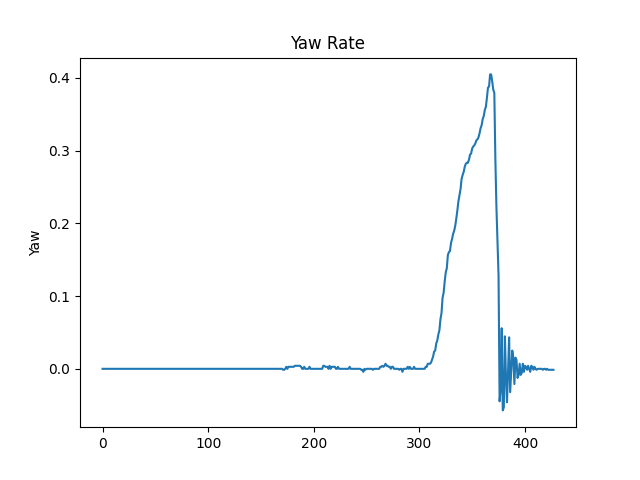
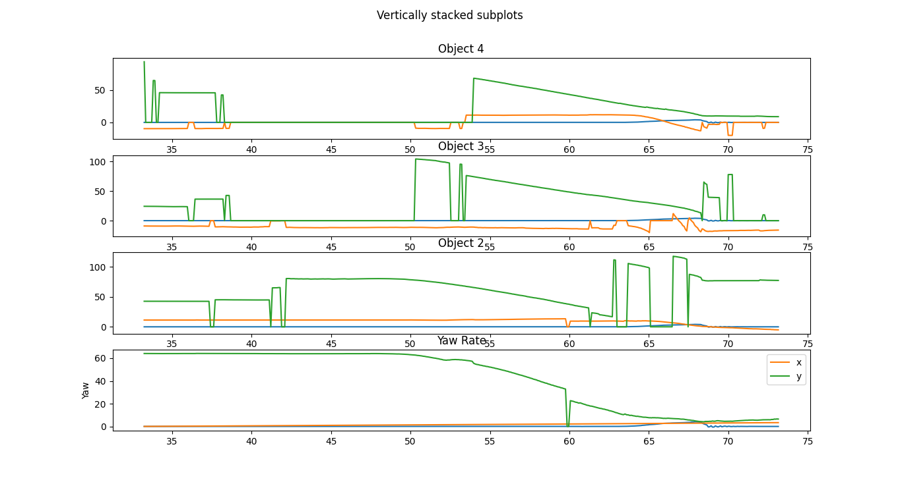

"# bosch" 
"# bosch" 

## Object Two Crashed during a right turn maneuver

We can observe from the spike that there was a sharp turn towards the right side indicating a right turn maneuver. The noise after the turn indicates the driver trying to balance the vehicle after the almost hit incident.

We also plot the data of all the objects over time to see where the hit occur and we can see this in the figure below.

